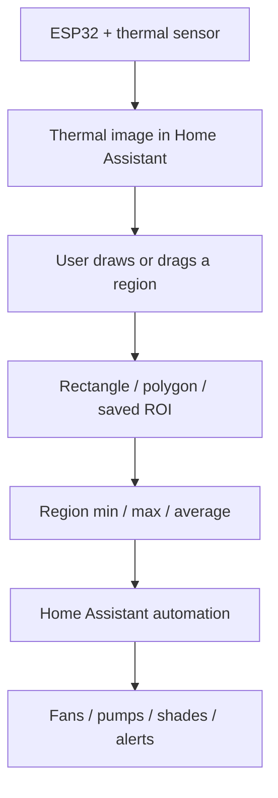

# 🌿 LeafSense

> Open-source thermal plant monitoring for ESPHome and Home Assistant.

LeafSense is a modular plant-monitoring platform built around ESP32 devices, ESPHome, Home Assistant, and thermal imaging. Its first hardware target is the Panasonic AMG8833 Grid-EYE 8 × 8 thermal sensor.

The project is being developed both as a practical plant-monitoring system and as a reusable, well-tested embedded software platform. The immediate goal is reliable thermal acquisition and publication. The longer-term goal is an easy-to-use Home Assistant experience where users can draw regions of interest over a thermal image and monitor the minimum, maximum, and average temperatures inside those regions.

## Project status

**Version:** `v0.1 — Seed`  
**Status:** Early development  
**Current completed milestone:** `1.8 — Publication-ready telemetry`  
**Next major objective:** ESPHome platform integration

The native C++ thermal core and AMG8833 driver are being developed and tested independently of ESPHome. This keeps the hardware and processing logic reusable while allowing ESPHome to remain the primary deployment platform.

## Vision

LeafSense is intended to provide:

- ESP32 thermal-sensing nodes managed through ESPHome.
- A Home Assistant dashboard that displays thermal data clearly.
- User-defined thermal regions of interest.
- Draggable rectangles, polygons, and other region shapes.
- Minimum, maximum, and average temperatures for each region.
- Environmental sensors and automation controls.
- A modular architecture that can support additional sensors.
- Future environmental prediction and control assistance using a compact local model or similar edge-intelligence approach.

The predictive features are future work. They will only be introduced after the sensor, processing, ESPHome, and Home Assistant foundations are stable.

## Current architecture

```mermaid
flowchart LR
    Sensor["AMG8833<br/>8 × 8 thermal sensor"]
    Bus["Amg8833Bus<br/>platform abstraction"]
    Driver["Amg8833Driver<br/>acquisition and recovery"]
    Processor["ThermalProcessor<br/>decode and filtering"]
    Frame["ThermalFrame<br/>processed 64-pixel frame"]
    Snapshot["Amg8833SnapshotReader<br/>frame + summary + diagnostics"]
    Telemetry["Amg8833TelemetryProjector<br/>Milestone 1.8"]
    ESPHome["ESPHome component<br/>next integration layer"]
    HA["Home Assistant<br/>entities and dashboard"]

    Sensor --> Bus --> Driver --> Processor --> Frame --> Snapshot --> Telemetry --> ESPHome --> HA
```



Milestone 1.8 is the boundary between the rich native driver model and the future ESPHome component. It converts a complete AMG8833 snapshot into flat, publication-ready values that ESPHome can expose without depending on driver internals.

See [Architecture](docs/Architecture.md), [AMG8833 Driver](docs/Driver_AMG8833.md), and [Telemetry](docs/Telemetry.md) for details.

## Implemented foundation

The current repository includes:

- A platform-independent C++17 thermal core.
- An immutable-by-consumer `ThermalFrame` data model.
- AMG8833 register decoding.
- Optional spatial and exponential filtering.
- A dependency-injected AMG8833 bus interface.
- Sensor initialization and frame acquisition.
- Driver health and automatic recovery tracking.
- Hardware interrupt configuration and interrupt-map decoding.
- Unified capture snapshots.
- Publication-ready telemetry projection.
- Native CMake builds.
- Catch2 unit tests.
- Compiler warnings enabled for supported toolchains.

## Planned user experience



This dashboard and region editor are planned features and are not yet implemented.

## Repository layout

```text
LeafSense/
├── leafsense-core/          Platform-independent thermal data and processing
├── drivers/
│   └── amg8833/             AMG8833 bus interface, driver, snapshots and telemetry
├── firmware/                Future device firmware and ESPHome integration
├── homeassistant/           Future dashboards and Home Assistant resources
├── simulator/               Future simulation tooling
├── examples/                Example configurations and usage
├── tools/                   Development utilities
├── docs/                    Architecture and developer documentation
├── CMakeLists.txt           Native project build
├── CONTRIBUTING.md          Contribution workflow
├── CHANGELOG.md             Project history
└── LICENSE                  MIT License
```

Some directories are placeholders for later roadmap stages.

## Build and test

Requirements:

- CMake 3.20 or newer
- A C++17 compiler
- Git
- Catch2, supplied through the repository's configured dependency process

Typical native build:

```bash
cmake -S . -B build -DLEAFSENSE_BUILD_TESTS=ON
cmake --build build --config Debug
ctest --test-dir build -C Debug --output-on-failure
```

On a single-configuration generator such as Ninja, omit `-C Debug` from the `ctest` command.

Detailed Windows and cross-platform instructions are in [Development](docs/Development.md).

## Development principles

LeafSense follows these standards:

1. Keep sensor and processing code independent of ESPHome.
2. Use dependency injection at hardware boundaries.
3. Prefer fixed-size storage and avoid heap allocation in core runtime paths.
4. Keep data objects simple and predictable.
5. Develop functionality with unit tests.
6. Treat warnings as useful defects, not background noise.
7. Keep commits focused and leave the project buildable.
8. Update documentation alongside code.
9. Prefer simple, explicit designs over clever abstractions.
10. Preserve published APIs where practical.

## Documentation

- [Project charter](docs/PROJECT_CHARTER.md)
- [Architecture](docs/Architecture.md)
- [Roadmap](docs/Roadmap.md)
- [Development guide](docs/Development.md)
- [Testing guide](docs/Testing.md)
- [AMG8833 driver design](docs/Driver_AMG8833.md)
- [Telemetry and Milestone 1.8](docs/Telemetry.md)
- [Home Assistant vision](docs/Home_Assistant_Vision.md)

## Contributing

LeafSense is primarily developed for its maintainer's own plant-monitoring system, but contributions, testing, documentation improvements, and hardware feedback are welcome.

Read [CONTRIBUTING.md](CONTRIBUTING.md) before opening a pull request.

## License

LeafSense is released under the [MIT License](LICENSE).
