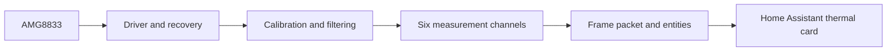

# 🌿 LeafSense

> Open-source thermal plant monitoring for ESPHome and Home Assistant.

LeafSense is a modular ESP32 plant-monitoring platform. It currently combines an AMG8833 8 × 8 thermal sensor, ESPHome, and a custom Home Assistant card that displays a live thermal image and sends editable measurement regions to the ESP32.

## Project status

**Version:** `3.0.0-alpha.1`

**Milestone:** `3.0 Alpha — end-to-end thermal camera prototype`

**Status:** Working, hardware-tested dashboard alpha; minor UI polish and release packaging remain

The complete data path has been demonstrated on hardware: the AMG8833 frame reaches Home Assistant, the thermal image renders live, all six stable measurement channels work, direct pixel-mask ROIs can be edited and named, and minimum, maximum, average, and pixel-count statistics update. ROI masks and custom names survive a refresh in the same browser. Calibration gain and offset are saved on the ESP32 and restored after a restart.

The dashboard is now a working alpha checkpoint. It still needs minor interface improvements and a clean-install release guide. ROI masks are browser-local and are not yet restored by the ESP32 after a device restart.

## What works now

- ESP32/ESPHome acquisition from the Panasonic AMG8833.
- Full 8 × 8 frame transport using a versioned Base64 packet with CRC32.
- Sensor-wide gain and offset calibration before channel processing.
- Calibration values written to the ESP32; explicit save and restore-default controls.
- Dead-pixel correction, temporal smoothing, and optional spatial filtering.
- Six fixed measurement channels, each disabled or defined by an arbitrary 8×8 pixel mask.
- ESP32 calculation of channel minimum, maximum, average, and pixel count.
- Stable Home Assistant entities for all six channels.
- Live thermal rendering and ROI overlays in a custom Home Assistant card.
- Click-toggle and drag paint/erase ROI editing with per-channel colours and custom names.
- Browser persistence of all six ROI masks and names across dashboard refreshes.
- Full-frame minimum, average, and maximum temperature display.
- Runtime ROI updates through ESPHome actions without editing YAML or reflashing.
- Automatic calibration persistence across ESP32 restarts.
- Native CMake/Catch2 tests for the reusable core and driver.

## Known Milestone 3.0 Alpha limitations

- ROI geometry is not persisted by the ESP32 and returns to disabled after a device restart.
- ROI names and masks are stored only in the current browser, so they do not automatically follow the user to another browser or device.
- Minor dashboard layout, input, mobile, and visual polish remains.
- The install path and Home Assistant/ESPHome package are still being validated and documented for repeatable use.

## Current architecture



All thermal calculations remain in Celsius. The dashboard may convert values for display. Calibration is sensor-wide and is applied before the six measurement channels are evaluated.

## Next major goal

The next phase is to turn the alpha prototype into a repeatable Home Assistant experience:

1. Apply the remaining minor dashboard usability and mobile-layout improvements.
2. Add ESP32-side ROI persistence and safe synchronisation with browser state.
3. Test a clean installation from ESPHome Device Builder and Home Assistant.
4. Publish verified wiring, ESPHome package, dashboard installation, upgrade, and troubleshooting instructions.

After that foundation is stable, LeafSense will expand into plant-specific environmental monitoring. The planned next sensor is the BME688 for air temperature, humidity, pressure, and VOC/gas measurements. CO₂ will only be described as estimated when derived from gas sensing; a dedicated CO₂ sensor can be added if true CO₂ measurement is required. LeafSense will calculate VPD using air conditions and ROI leaf temperature as the leaf-temperature offset, then display those results alongside the thermal image.

Fans and other actuators, followed by guarded automation or AI-assisted control, are later phases.

## Repository layout

```text
LeafSense/
├── components/             Git-importable ESPHome component
├── packages/               Reusable ESPHome package
├── leafsense-core/         Platform-independent processing and ROI logic
├── drivers/amg8833/        AMG8833 driver, snapshots, health and recovery
├── firmware/esphome/       ESPHome integration sources
├── homeassistant/          Thermal card, dashboard YAML and browser tests
├── examples/esphome/       Example and import configurations
├── docs/                   Architecture, roadmap and developer guides
└── leafsense-amg8833.yaml  ESPHome Device Builder import manifest
```

## Native build and test

Requirements: CMake 3.20+, a C++17 compiler, and Git.

```bash
cmake -S . -B build -DLEAFSENSE_BUILD_TESTS=ON
cmake --build build --config Debug
ctest --test-dir build -C Debug --output-on-failure
```

For Ninja or another single-configuration generator, omit `-C Debug` from `ctest`.

## Documentation

- [Milestone 3.0 Alpha status](docs/Milestone_3_0_Alpha.md)
- [Home Assistant dashboard](homeassistant/README.md)
- [Architecture](docs/Architecture.md)
- [Roadmap](docs/Roadmap.md)
- [Development guide](docs/Development.md)
- [Testing guide](docs/Testing.md)
- [AMG8833 driver](docs/Driver_AMG8833.md)
- [Telemetry](docs/Telemetry.md)
- [Project charter](docs/PROJECT_CHARTER.md)

## Contributing and licence

Contributions, hardware testing, and documentation improvements are welcome. Read [CONTRIBUTING.md](CONTRIBUTING.md) before opening a pull request.

LeafSense is released under the [MIT License](LICENSE).
