# LeafSense Architecture

## 1. Purpose

LeafSense is a modular ESP32 plant-monitoring platform whose primary deployment target is ESPHome and Home Assistant.

The architecture separates hardware access, thermal processing, sensor-facing coordination, platform publication, and user-interface concerns. This separation allows the AMG8833 implementation to be tested on a desktop computer and reused outside ESPHome where practical, while keeping ESPHome as the main supported platform.

## 2. Architectural goals

LeafSense is designed to:

- Run on ESP32 devices through ESPHome.
- Keep the thermal core free of ESPHome, Arduino, and ESP-IDF dependencies.
- Keep I²C access behind a small interface.
- Make sensor failures observable and recoverable.
- Avoid dynamic allocation in core capture paths.
- Produce deterministic, testable data transformations.
- Support future thermal sensors without redesigning Home Assistant intergration.
- Support interactive regions of interest and environmental automation.
- Leave room for future local prediction without coupling it to acquisition.

## 3. System context

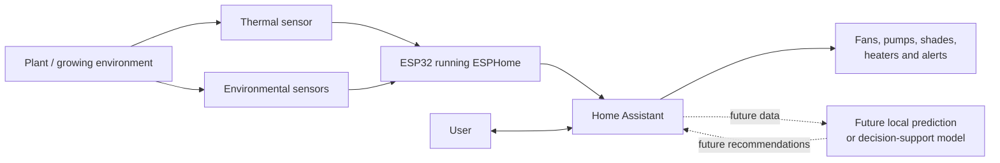

## 4. Logical layers

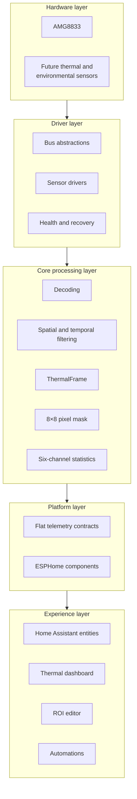

### Hardware layer

Physical sensors and actuators. The first thermal target is the Panasonic AMG8833, which produces an 8 × 8 grid of temperatures.

### Driver layer

Owns communication with a sensor, initialization, status handling, error reporting, and recovery. Drivers operate through injected bus interfaces rather than directly calling ESPHome or Arduino APIs.

### Core processing layer

Contains platform-independent data types and transformations. It decodes raw sensor data, constructs `ThermalFrame` instances, and applies optional filtering.

Geometry and region-statistics modules live here because their behaviour does not depend on Home Assistant. Six fixed channels bound ESP32 memory use while allowing runtime geometry changes without entity recreation.

### Platform layer

Adapts platform-independent results to ESPHome. The current component publishes scalar telemetry, a full-frame packet, calibration controls, and six stable channel entity sets, and registers runtime actions for channel geometry.

### Experience layer

Contains Home Assistant entities, dashboards, region editing, and automation behavior. It consumes published data and commands rather than communicating directly with the AMG8833 driver.

## 5. Current AMG8833 runtime pipeline

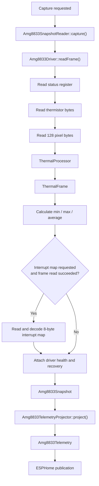

## 6. Major current components

### `ThermalFrame`

`ThermalFrame` represents one processed 8 × 8 capture. It stores:

- 64 floating-point pixel temperatures.
- Thermistor temperature.
- Frame number.
- Timestamp.
- Overall validity.

The frame is a data container. It deliberately does not perform filtering, statistics, or hardware communication.

### `ThermalProcessor`

`ThermalProcessor` converts raw AMG8833 register data into a `ThermalFrame`. Its pipeline is:

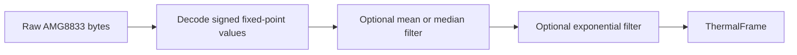

Spatial filtering occurs before temporal filtering. Invalid frames do not update temporal history.

### `Amg8833Bus`

`Amg8833Bus` is the hardware boundary. A platform adapter supplies register read and write behavior.

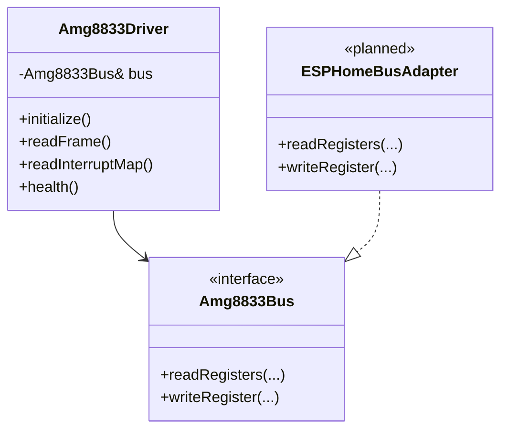

This makes unit testing possible with a fake bus and keeps the driver reusable.

### `Amg8833Driver`

The driver owns:

- Register-level initialization.
- Frame and thermistor acquisition.
- Sensor status decoding.
- Interrupt configuration and map reads.
- Driver errors.
- Health counters.
- Automatic recovery decisions.
- Frame numbering.
- Coordination with `ThermalProcessor`.

The driver does not publish Home Assistant entities.

### `Amg8833SnapshotReader`

The snapshot reader coordinates one sensor-facing capture. It combines:

- A `ThermalFrame`.
- Frame summary statistics.
- Sensor status.
- Optional interrupt-map results.
- Driver health.
- Per-operation errors.
- Recovery results.
- Availability and completeness helpers.

It owns no sensor state and performs no direct bus operations.

### `Amg8833TelemetryProjector`

The projector was introduced in Milestone 1.8. It has no state and no hardware access. It maps `Amg8833Snapshot` to `Amg8833Telemetry`.

This is an anti-corruption layer between native driver objects and platform publication.

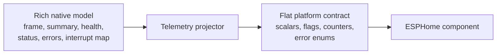

## 7. Availability semantics

LeafSense distinguishes several kinds of success.

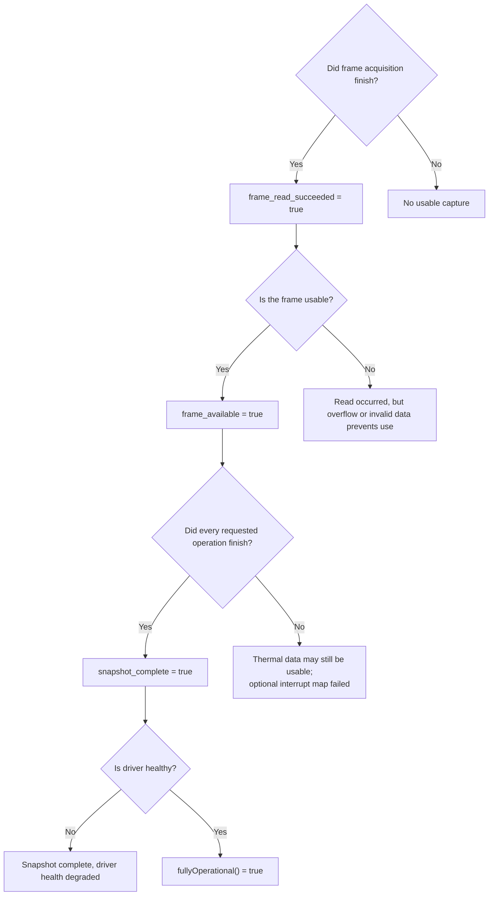

These distinctions stop platform code from publishing default zero values as genuine temperatures.

## 8. Recovery architecture

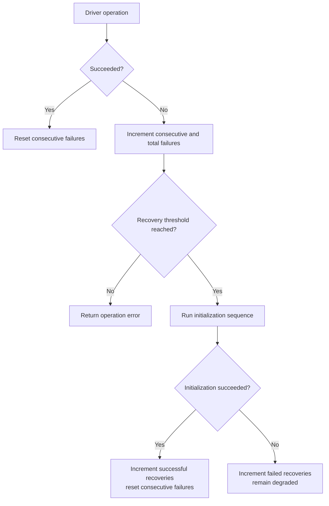

Recovery is visible through health counters and snapshot-level flags. It is not hidden from callers.

## 9. Measurement-channel architecture

Milestone 3.0 Alpha implements six fixed measurement channels. Each channel is always represented by the same Home Assistant entity set and may be disabled or contain an arbitrary 8×8 pixel mask. Home Assistant sends eight row masks at runtime; the ESP32 applies the selection to the processed frame and calculates minimum, maximum, average, and pixel count.

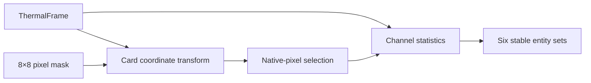

The fixed limit of six channels preserves predictable memory use and leaves room for future environmental sensors. Calibration occurs once for the whole sensor before channel processing and is restored from ESP32 flash. Browser storage restores the six masks and custom names after a dashboard refresh. The remaining architecture work is ESP32-side ROI persistence and safe synchronisation between device and browser state.

## 10. Current Home Assistant data flow

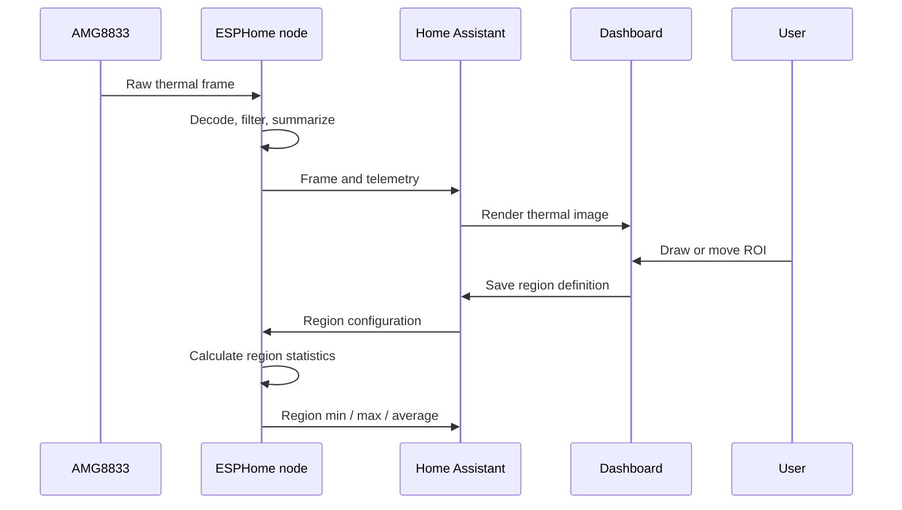

This sequence is implemented in the alpha. The browser reconstructs ROI masks and names after refresh, while the ESP32 does not yet persist channel geometry across restart.

## 11. Future prediction layer

A small local model or similar mechanism may eventually predict environmental changes and assist with controls.

It must be isolated from safety-critical control and raw acquisition. Initial use should be advisory:

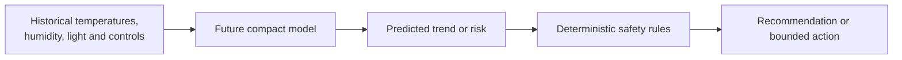

The model should not bypass deterministic limits, manual override, or Home Assistant safety rules.

## 12. Dependency rules

Allowed dependency direction:

```text
Experience → Platform → Driver coordination → Core → standard library
                          ↓
                    bus abstraction
```

Rules:

- Core code must not include ESPHome headers.
- Driver code must not include Home Assistant or dashboard code.
- ESPHome adapters may depend on core and driver APIs.
- User-interface code should consume platform contracts.
- Future prediction modules consume published history or stable core types.
- Hardware-specific behavior remains behind interfaces.

## 13. Memory and runtime approach

The current thermal image is fixed at 64 pixels. Core components therefore favor:

- `std::array` and fixed-size structures.
- Stack or object-owned storage.
- No heap allocation in capture and projection paths.
- Explicit status flags and errors.
- Small value types.
- Deterministic processing cost.

## 14. Testing boundaries

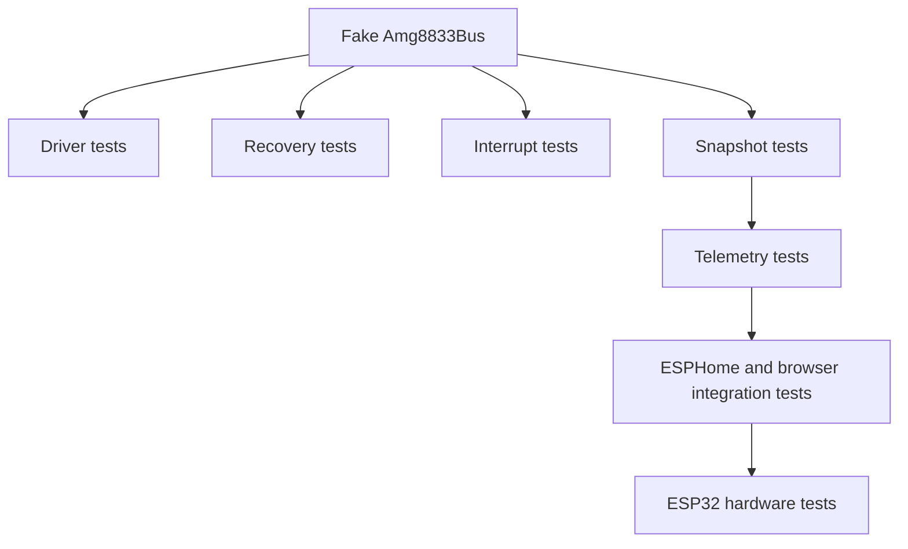

Native tests validate behavior without a physical device. Hardware testing remains required before a feature is considered production-ready.
