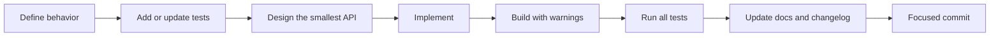

# Development Guide

## 1. Scope

This guide covers native development of the LeafSense C++ core and AMG8833 driver. ESPHome build and installation instructions will be added when the ESPHome component exists.

## 2. Requirements

Minimum requirements:

- Git
- CMake 3.20 or newer
- A compiler with C++17 support
- A build backend supported by CMake
- Catch2 through the repository's configured dependency setup

Recommended tools on Windows:

- Visual Studio 2022 Build Tools or Visual Studio Community
- Desktop development with C++
- CMake
- Ninja, optional
- Visual Studio Code with the C/C++ and CMake Tools extensions, optional

Recommended tools on Linux:

```bash
sudo apt update
sudo apt install build-essential cmake ninja-build git
```

Package names vary by distribution.

## 3. Configure the project

From the repository root:

```bash
cmake -S . -B build -DLEAFSENSE_BUILD_TESTS=ON
```

This creates or refreshes the build directory.

For Ninja:

```bash
cmake -S . -B build -G Ninja -DLEAFSENSE_BUILD_TESTS=ON
```

For a 64-bit Visual Studio 2022 build:

```powershell
cmake -S . -B build -G "Visual Studio 17 2022" -A x64 -DLEAFSENSE_BUILD_TESTS=ON
```

Do not reuse a build directory configured for a different generator, architecture, or toolchain. Delete it or create a separate directory.

Examples:

```powershell
cmake -S . -B build-vs2022 -G "Visual Studio 17 2022" -A x64
cmake -S . -B build-ninja -G Ninja
```

## 4. Build

Generic command:

```bash
cmake --build build
```

Visual Studio multi-configuration build:

```powershell
cmake --build build --config Debug
```

Release build:

```powershell
cmake --build build --config Release
```

Parallel build:

```bash
cmake --build build --parallel
```

## 5. Run tests

Single-configuration generators:

```bash
ctest --test-dir build --output-on-failure
```

Visual Studio and other multi-configuration generators:

```powershell
ctest --test-dir build -C Debug --output-on-failure
```

List tests without running them:

```bash
ctest --test-dir build -N
```

Run only AMG8833 telemetry tests:

```bash
ctest --test-dir build -R amg8833_telemetry --output-on-failure
```

The exact registered name should be confirmed with `ctest -N`.

## 6. Clean rebuild

A clean rebuild is the first response to stale generator, architecture, or cached configuration problems.

PowerShell:

```powershell
Remove-Item -Recurse -Force build
cmake -S . -B build -G "Visual Studio 17 2022" -A x64 -DLEAFSENSE_BUILD_TESTS=ON
cmake --build build --config Debug
ctest --test-dir build -C Debug --output-on-failure
```

Command Prompt:

```bat
rmdir /s /q build
cmake -S . -B build -G "Visual Studio 17 2022" -A x64 -DLEAFSENSE_BUILD_TESTS=ON
cmake --build build --config Debug
ctest --test-dir build -C Debug --output-on-failure
```

Bash:

```bash
rm -rf build
cmake -S . -B build -DLEAFSENSE_BUILD_TESTS=ON
cmake --build build
ctest --test-dir build --output-on-failure
```

## 7. Confirm CMake is installed

PowerShell:

```powershell
cmake --version
Get-Command cmake
```

When `cmake.exe` exists but is not on `PATH`, for example under:

```text
C:\Program Files\CMake\bin\cmake.exe
```

restart the terminal after installation or add that directory to the system `PATH`.

Temporary PowerShell session:

```powershell
$env:Path += ";C:\Program Files\CMake\bin"
cmake --version
```

## 8. Project build options

### `LEAFSENSE_BUILD_TESTS`

Controls whether native unit tests are built.

Enabled:

```bash
cmake -S . -B build -DLEAFSENSE_BUILD_TESTS=ON
```

Disabled:

```bash
cmake -S . -B build -DLEAFSENSE_BUILD_TESTS=OFF
```

Tests should normally remain enabled during development.

## 9. Code organization

### Core

`leafsense-core/` contains types and algorithms that do not communicate with hardware or ESPHome.

Typical responsibilities:

- `ThermalFrame`
- AMG8833 numeric decoding
- Spatial filtering
- Exponential filtering
- Thermal processing

### Driver

`drivers/amg8833/` contains:

- The bus abstraction.
- Driver public API.
- Register acquisition and initialization.
- Recovery and health.
- Interrupt support.
- Snapshot coordination.
- Telemetry projection.
- Driver-level tests.

### Platform and future directories

Firmware, ESPHome, Home Assistant, simulation, examples, and tooling should depend on the native core rather than duplicating its behavior.

## 10. Coding standards

### Language

- C++17.
- CMake 3.20 or newer.
- No compiler extensions required.

### Ownership and allocation

- Prefer value types and references.
- Prefer fixed-size containers for fixed-size sensor data.
- Avoid heap allocation in normal capture and projection paths.
- Make ownership explicit.

### Interfaces

- Use small interfaces at hardware boundaries.
- Keep platform code out of core and driver modules.
- Avoid exposing platform types through reusable APIs.

### Errors

- Return structured error information.
- Do not hide recovery attempts.
- Distinguish unavailable data from valid zero values.
- Keep diagnostics publishable.

### Formatting

Follow the existing style:

- Four-space indentation.
- Opening braces on the following line for classes, functions, and control blocks.
- Descriptive names rather than abbreviations.
- Doxygen comments for public APIs.
- Namespace closing comments.
- Focused source files.

## 11. Compiler warnings

The project enables strict warning levels:

- MSVC: `/W4 /permissive-`
- GCC/Clang: `-Wall -Wextra -Wpedantic`

New warnings should be treated as defects unless a documented toolchain issue requires a targeted workaround.

## 12. Adding a feature

A normal feature workflow is:



Before marking a milestone complete:

- Code builds.
- All native tests pass.
- New behavior has direct tests.
- Failure behavior has tests.
- Documentation reflects the implementation.
- Hardware validation is performed when the change touches real device behavior.

## 13. Adding a new native test target

A test executable should:

1. Live near the module under test.
2. Link against the public library target.
3. Link against `Catch2::Catch2WithMain`.
4. Be registered with `add_test`.
5. Have a clear, stable test name.

Example pattern:

```cmake
add_executable(
    example_tests
    tests/example_test.cpp
)

target_link_libraries(
    example_tests
    PRIVATE
        leafsense::example
        Catch2::Catch2WithMain
)

add_test(
    NAME example_tests
    COMMAND example_tests
)
```

## 14. Catch2 version compatibility

Use headers and matcher syntax that match the repository's configured Catch2 version.

A common source of editor-only or stale diagnostics is mixing Catch2 v2 and v3 forms. For floating-point comparisons, use the form already used successfully in the repository and confirm with a clean compile rather than relying only on editor diagnostics.

After changing test syntax:

```powershell
cmake --build build --config Debug --clean-first
ctest --test-dir build -C Debug --output-on-failure
```

If the build and tests pass but the editor still shows old compiler errors, clear or reload the CMake configure state in the editor.

## 15. Before opening a pull request

Run:

```bash
cmake -S . -B build -DLEAFSENSE_BUILD_TESTS=ON
cmake --build build
ctest --test-dir build --output-on-failure
```

Then check:

- No unrelated generated files are staged.
- Build directories are ignored.
- Public API changes are documented.
- Roadmap status is accurate.
- `CHANGELOG.md` contains a concise entry.
- Commit messages explain behavior rather than only file names.
