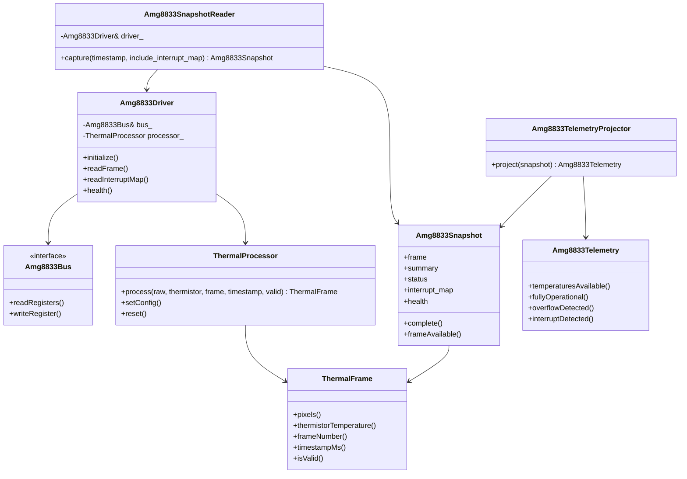
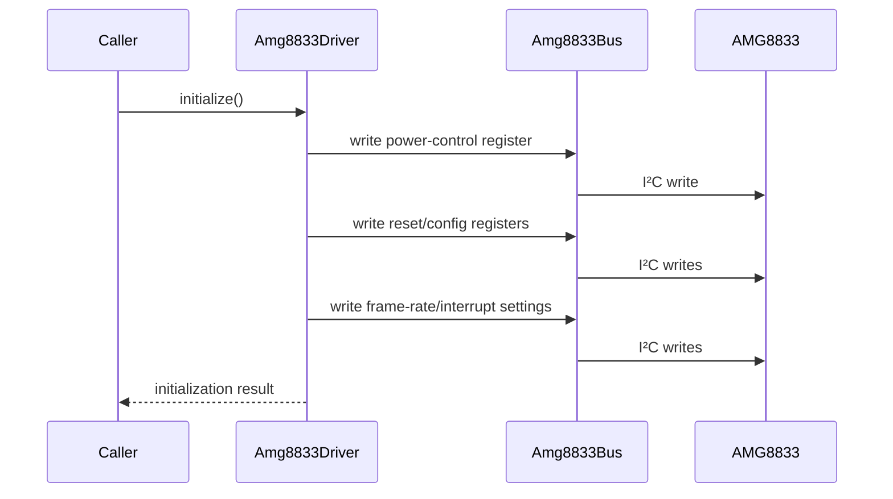
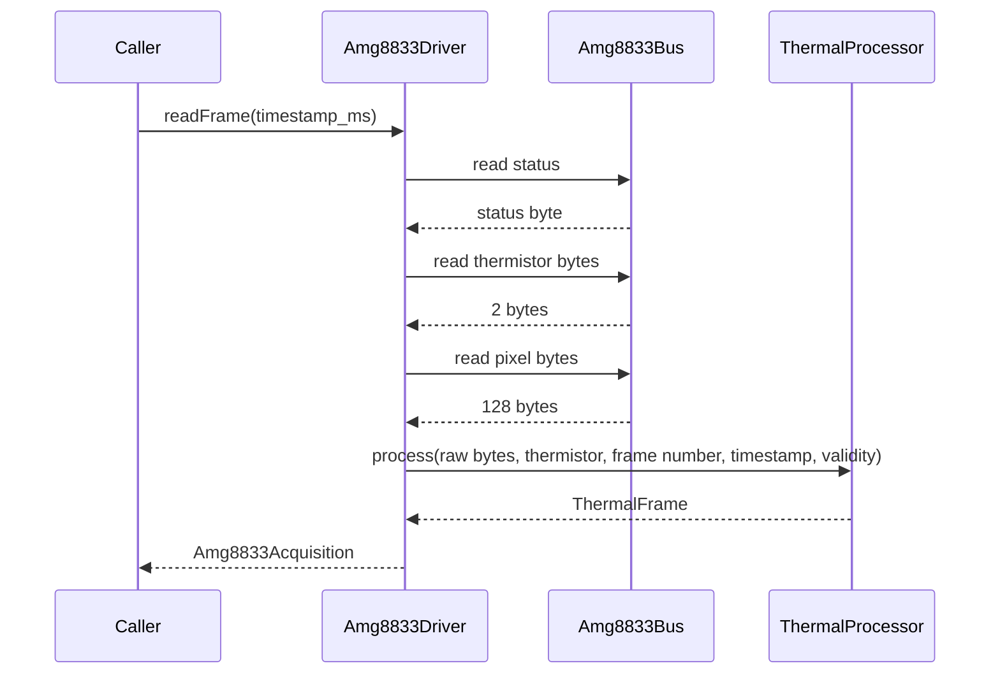
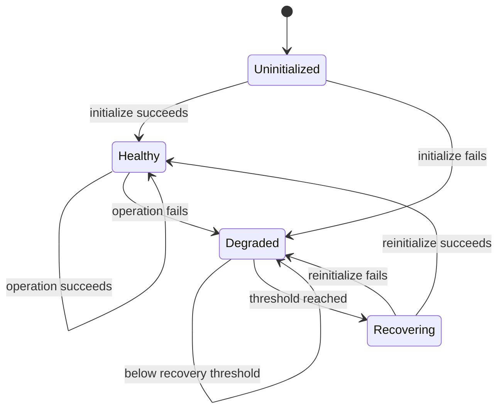
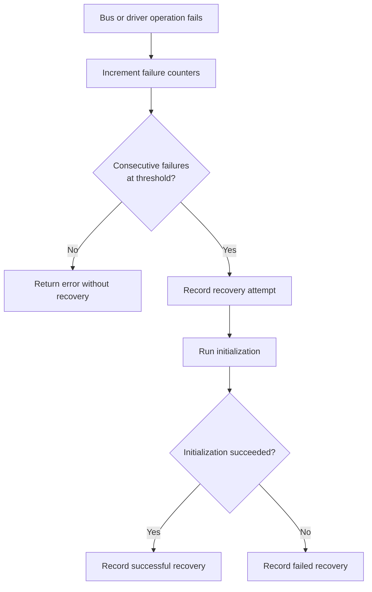
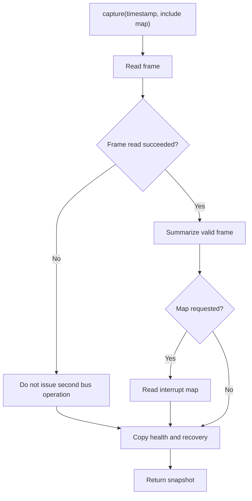

# AMG8833 Driver Design

## 1. Purpose

The AMG8833 driver provides reliable thermal acquisition for LeafSense while remaining independent of ESPHome and any specific I²C implementation.

The driver is designed to be the reusable sensor layer beneath an ESPHome external component.

## 2. Responsibilities

The AMG8833 module currently owns:

- Bus abstraction.
- Sensor initialization.
- Status-register acquisition and decoding.
- Thermistor acquisition.
- Full 8 × 8 pixel acquisition.
- Integration with `ThermalProcessor`.
- Structured driver errors.
- Health counters.
- Automatic recovery.
- Interrupt configuration and map acquisition.
- Snapshot construction.
- Telemetry projection.

It does not own:

- Home Assistant entities.
- ESPHome YAML validation.
- Dashboard rendering.
- Region editing.
- Automation decisions.
- Future prediction.

## 3. Component relationship

## 4. Bus abstraction

`Amg8833Bus` is intentionally small. The driver asks it to read a contiguous register range or write one register.

Benefits:

- Unit tests can inject a fake bus.
- ESPHome I²C can be added without modifying decoding logic.
- The driver can potentially be reused with another platform.
- Bus failures can be simulated deterministically.
- Driver code does not own platform lifecycle.

The ESPHome adapter translates ESPHome I²C return behaviour into the exact success/failure contract expected by `Amg8833Bus`.

## 5. Initialization

Initialization configures the device into a known state before acquisition.

Conceptually:

The exact register sequence remains defined by implementation and tests.

Initialization state is exposed through driver health rather than assumed by callers.

## 6. Frame acquisition

One frame read obtains status, thermistor, and all pixels.

A pixel uses two register bytes. The 64-pixel frame therefore requires 128 pixel bytes.

## 7. Processing

The driver delegates numeric decoding and filtering to `ThermalProcessor`.

This keeps register acquisition separate from image transformation.

## 8. Status and validity

The sensor status can indicate:

- Interrupt activity.
- Pixel temperature overflow.
- Thermistor overflow.

A bus read may succeed while the resulting frame is not safe to use. LeafSense therefore separates:

- Operation success.
- Frame validity.
- Snapshot completeness.
- Driver health.

Platform code must use availability flags rather than assuming that a successful function call means every temperature is publishable.

## 9. Errors

The driver returns structured `Amg8833DriverError` values.

Error handling principles:

- The first observable failure is returned.
- Failed data is marked unavailable.
- Counters are updated consistently.
- Recovery attempts remain visible.
- Optional interrupt-map failure does not necessarily invalidate a good thermal frame.
- Platform adapters should map errors into diagnostics, not discard them.

## 10. Health model

Driver health contains persistent runtime information such as:

- Whether the driver is initialized.
- Whether it is currently healthy.
- Consecutive failures.
- Total failures.
- Recovery attempts.
- Successful recoveries.
- Failed recoveries.

The exact internal health-state representation may use flags and counters rather than this formal state machine, but the diagram describes observable behavior.

## 11. Automatic recovery

Automatic recovery exists to handle transient sensor or bus failures without hiding them.

Recovery should never cause stale data to appear valid. The operation that triggered recovery still reports its own outcome.

## 12. Interrupt support

The AMG8833 can report threshold activity through a status flag and an 8-byte interrupt table.

The driver exposes:

- Sensor-level interrupt status.
- Decoded per-pixel interrupt map.
- Active interrupt-pixel count through later summary layers.
- Read errors and recovery behavior.

The interrupt map is optional during a snapshot because not every update requires the extra bus transaction.

## 13. Snapshot layer

`Amg8833SnapshotReader` produces one complete sensor-facing result.

The reader performs no heap allocation and owns no sensor state.

## 14. Frame summary

A valid snapshot summary includes:

- Minimum pixel temperature.
- Maximum pixel temperature.
- Average valid pixel temperature.
- Thermistor temperature.
- Number of valid pixels.
- Availability.

Summary calculations belong above `ThermalFrame`, preserving the frame as a simple data type.

## 15. Telemetry boundary

Milestone 1.8 introduced the platform-facing projection.

The driver model is rich and useful to native C++ code, but too coupled for direct entity publication. `Amg8833TelemetryProjector` copies and derives only values a platform should publish.

See [Telemetry](Telemetry.md) for the field groups and mapping rules.

## 16. ESPHome adapter requirements

The ESPHome component should continue to:

- Implement or own an `Amg8833Bus` adapter.
- Create and initialize the driver.
- Schedule captures at a safe update interval.
- Project each snapshot to telemetry.
- Publish only available values.
- Mark unavailable entities when required.
- Expose health and recovery as diagnostic entities.
- Avoid duplicating decoding, filtering, or recovery logic.
- Respect ESPHome component failure and warning states.
- Keep YAML schema separate from driver structures.

## 17. Reusability

ESPHome is the primary platform. Reuse is a secondary benefit.

The native library remains reusable when doing so does not:

- Complicate ESPHome integration.
- Add unnecessary abstractions.
- Increase ESP32 memory use without value.
- Make public APIs harder to understand.
- Delay the working plant-monitoring system.

## 18. Known limitations

At the current stage:

- The sensor resolution is fixed to 8 × 8 in `ThermalFrame`.
- ESPHome integration is not yet the completed platform path.
- Home Assistant thermal rendering is not implemented.
- Regions of interest are not implemented.
- No calibration workflow is finalized.
- No environmental prediction model is selected.
- Native tests do not replace physical sensor validation.

## 19. Extension points

Future work can extend the design through:

- New bus adapters.
- New thermal-sensor drivers.
- A sensor-neutral frame interface if a real second sensor requires it.
- Region geometry and masks.
- Region statistics.
- Stream serialization.
- ESPHome services or configuration entities.
- Home Assistant dashboard components.
- Simulation inputs.
