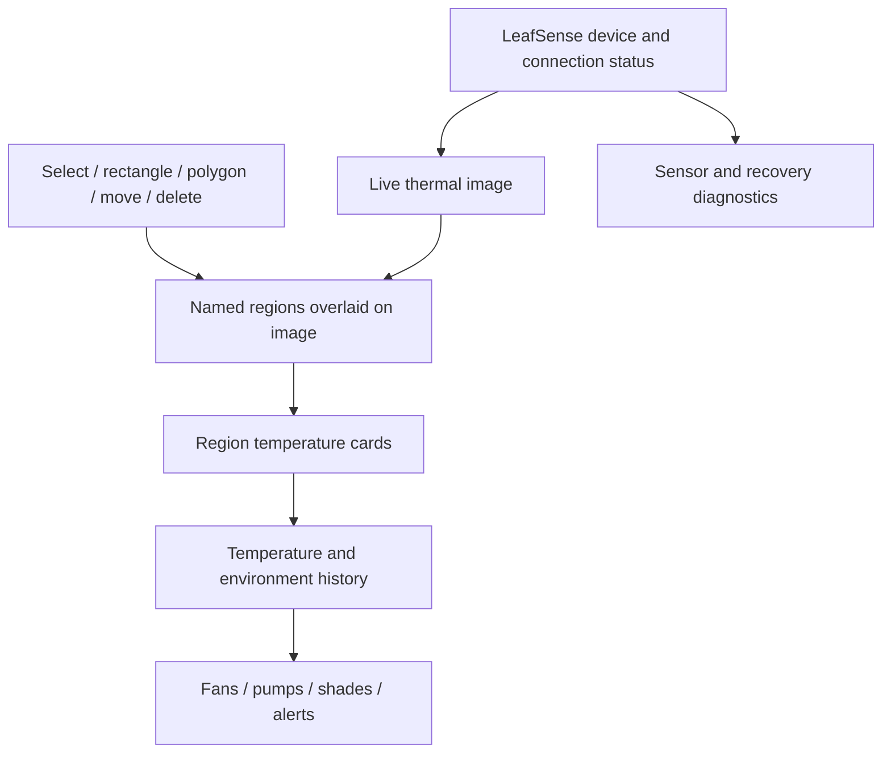
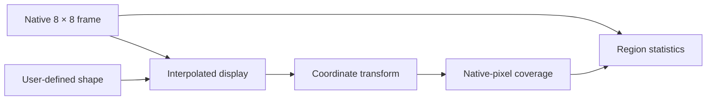
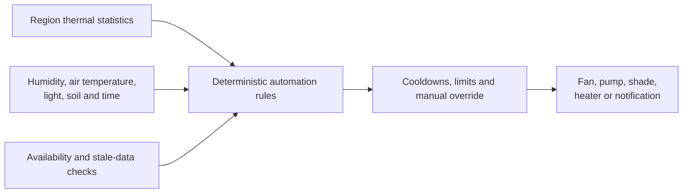

# Home Assistant Experience Vision

## 1. Goal

LeafSense should make thermal plant monitoring useful without requiring users to understand raw sensor grids, register values, or image-processing mathematics.

The intended experience is an approachable Home Assistant dashboard where a user can:

- View the current thermal image.
- Identify plants, leaves, trays, pots, or growing zones.
- Draw regions directly over the image.
- Drag, resize, and rename regions.
- Select rectangles, polygons, and later other shapes.
- Monitor minimum, maximum, and average temperature for each region.
- Combine leaf surface thermal data with air, humidity, light, soil, and other data to calulate VPD and other parameters. 
- Create safe automations.
- Understand sensor health and stale data.

Milestone 3.0 Alpha now implements the central prototype: live thermal rendering, six fixed rectangle/polygon measurement channels, ESP32-computed statistics, and calibration writes. The editing, persistence, installation, and presentation work described here remains the path from the alpha prototype to a stable user experience.

## 2. Dashboard concept



## 3. Region editing

### Initial region types

- Rectangle.
- Polygon.
- Full frame.

Potential later types:

- Ellipse.
- Brush or freehand mask.
- Exclusion zone.
- Region created from a temperature threshold.

### Editing actions

- Create.
- Select.
- Drag.
- Resize.
- Move polygon vertices.
- Rename.
- Change display style.
- Enable or disable.
- Duplicate.
- Delete.
- Save as a template.

## 4. Coordinate model

The AMG8833 produces only 8 × 8 native pixels. The dashboard may interpolate that grid for readability, but region calculations must remain grounded in sensor coordinates.



The design must clearly state whether a shape includes:

- Any pixel whose center lies inside it.
- Any pixel touched by it.
- A weighted portion of each pixel.

A simple, explainable rule should be used first.

## 5. Region data model

The current implementation uses six stable measurement channels. Each channel has a fixed numeric identity and a runtime type of disabled, rectangle, or polygon. A future persisted and versioned representation may also contain:

```text
Region
├── stable identifier
├── user-visible name
├── enabled state
├── shape type
├── normalized coordinates
├── statistic selection
├── display settings
├── optional thresholds
└── revision/version
```

Coordinates should be normalized rather than tied to one screen size.

## 6. Region statistics

Each region may provide:

- Minimum temperature.
- Maximum temperature.
- Average temperature.
- Valid-pixel count.
- Hottest-pixel location.
- Coldest-pixel location.
- Temperature range.
- Trend or rate of change.
- Threshold state.

The first implementation should focus on min, max, average, and valid-pixel count.

## 7. Processing location

Three possible designs exist.

### On ESP32

Advantages:

- Region entities update directly from ESPHome.
- Automations can continue locally.
- Less data needs to leave the device.

Disadvantages:

- Region editing and synchronization are more complex.
- Memory and CPU are limited.
- Polygon processing must remain bounded.

### In Home Assistant

Advantages:

- Flexible UI and computation.
- Easier persistence and editing.
- More resources.

Disadvantages:

- Requires full-frame transport.
- Local ESPHome automations cannot use regions without feedback.
- More integration code.

### Hybrid

Current design:

1. Home Assistant displays the frame and edits shapes.
2. Shapes are held by the card during the browser session; durable Home Assistant storage is next-step work.
3. Compact normalized region definitions are sent to the ESP32.
4. The ESP32 computes basic region statistics.
5. Home Assistant displays those statistics and history.

The transport and ESP32 calculation path has been validated on hardware. Browser and ESP32 persistence still need implementation and restart testing.

## 8. Thermal image transport

Milestone 3.0 Alpha transports all 64 pixels in a versioned Base64 packet protected by CRC32 and published through an ESPHome text sensor. Ongoing validation covers:

- Update rate.
- Payload size.
- Home Assistant recorder impact.
- ESPHome API support.
- Dashboard-card complexity.
- Reconnection behavior.
- Multiple devices.
- Version compatibility.

LeafSense therefore avoids creating 64 frequently updating standard sensor entities.

## 9. Automation model



Examples:

- Alert when a leaf region exceeds an air-temperature differential.
- Run ventilation when canopy temperature and humidity are high.
- Stop or inhibit control when the thermal frame is stale.
- Notify when one region diverges from neighboring plants.
- Use cooldowns to prevent rapid actuator cycling.

## 10. Diagnostics

The dashboard should make failure visible without overwhelming normal users.

Primary status:

- Online/offline.
- Thermal data available/unavailable.
- Last successful frame.
- Device warning.

Advanced diagnostics:

- Consecutive and total failures.
- Recovery attempts.
- Successful and failed recoveries.
- Frame and interrupt errors.
- Overflow.
- Update duration.
- Wi-Fi and API quality.

## 11. Future prediction

Prediction should follow data quality, not precede it.

Potential goals:

- Forecast greenhouse temperature or humidity.
- Detect unusual plant-temperature patterns.
- Estimate risk of heat stress.
- Recommend ventilation or shading.
- Predict the effect of a recent control action.

A language model may not be the best technical fit. Time-series forecasting, anomaly detection, regression, or rules may be smaller and more reliable. The project should choose the simplest model that provides measurable value.

## 12. Safety principles for intelligent control

- Predictions start as advisory.
- Deterministic limits remain authoritative.
- Manual override is always available.
- Missing or stale data blocks unsafe actions.
- Model confidence and input freshness are visible.
- Actions have bounded duration and rate.
- Model behavior is testable and logged.
- The system fails safe when Home Assistant or a sensor is unavailable.

## 13. Suggested implementation stages

1. ✅ Scalar ESPHome entities.
2. ✅ Full-frame transport and thermal rendering.
3. ✅ Alpha rectangle/polygon channels and ESP32 statistics.
4. 🚧 Repair UI, persist/synchronise regions, and publish tested installation instructions.
5. 🗓️ Add BME688 environmental context and leaf VPD using ROI temperatures.
6. 💡 Add safeguarded actuator automations.
7. 💡 Research prediction or AI assistance.

Do not begin prediction work before stable region data and environmental history exist.
