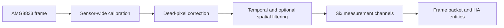

# Milestone 3.0 Alpha

## Purpose

Milestone 3.0 Alpha records the first demonstrated end-to-end LeafSense thermal-camera system and its working Home Assistant dashboard. It is a hardware-tested alpha checkpoint, not yet a polished installation release.

## Demonstrated on hardware

- Live AMG8833 frame acquisition on ESP32 through ESPHome.
- Full thermal image displayed in Home Assistant.
- Six fixed measurement channels exposed as stable entity sets.
- Direct 8×8 pixel masks written from Home Assistant to the ESP32.
- Correct per-channel minimum, maximum, average, and pixel-count results.
- Sensor-wide calibration values written to the ESP32.
- Calibration gain and offset restored from ESP32 flash after restart.
- Click-toggle and drag paint/erase editing for all six pixel-mask ROIs.
- ROI masks and custom names restored after refreshing the same browser.
- Full-frame and per-channel temperature statistics displayed in the dashboard.

## Alpha defects and incomplete work

| Area | Current state | Required outcome |
|---|---|---|
| ROI editor | Working hardware alpha | Minor desktop, touch, and layout polish |
| Browser persistence | Six masks and names restore in the same browser | Continue regression testing and improve cross-device synchronisation |
| Device persistence | Channels reset after ESP32 restart | Versioned, validated persistent storage |
| Calibration | Gain and offset persist across ESP32 restarts | Minor control and feedback polish |
| Statistics UI | Full-frame and six-channel values work | Minor presentation and mobile polish |
| Installation | Package/import files exist | Repeatable, tested Device Builder and HA guide |

## Processing contract

Each channel is always addressable as channel 1–6 and may be disabled or contain an arbitrary set of AMG8833 pixels. A disabled channel keeps its entity identities but publishes no usable measurement. Custom channel names currently live in browser storage.

## Exit criteria

Milestone 3.0 can move beyond alpha when the remaining dashboard polish is complete, ROI configuration survives device restarts, and a clean installation has passed the published Home Assistant and ESPHome Device Builder instructions.

## Following milestone

After the thermal camera package is stable, integrate environmental sensing—beginning with the BME688—and calculate air and leaf VPD using ROI leaf temperatures. Actuator control and AI/predictive assistance remain later phases.
