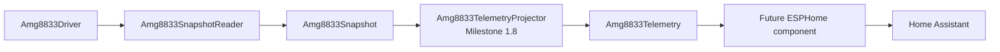
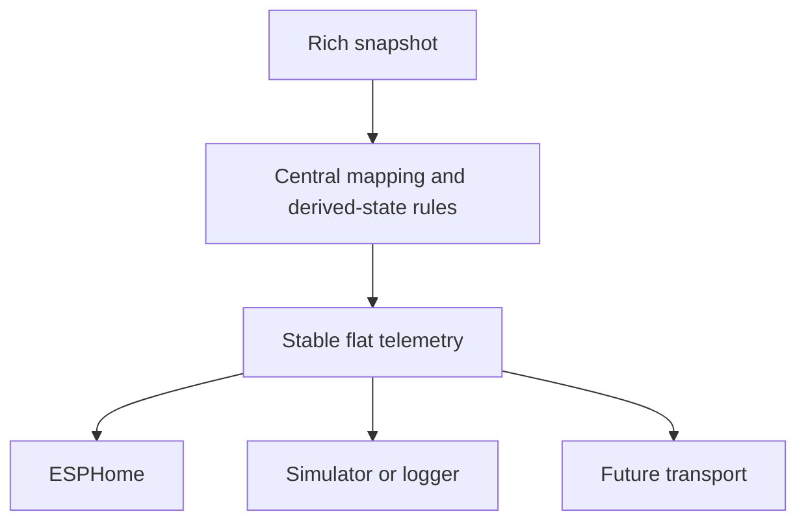
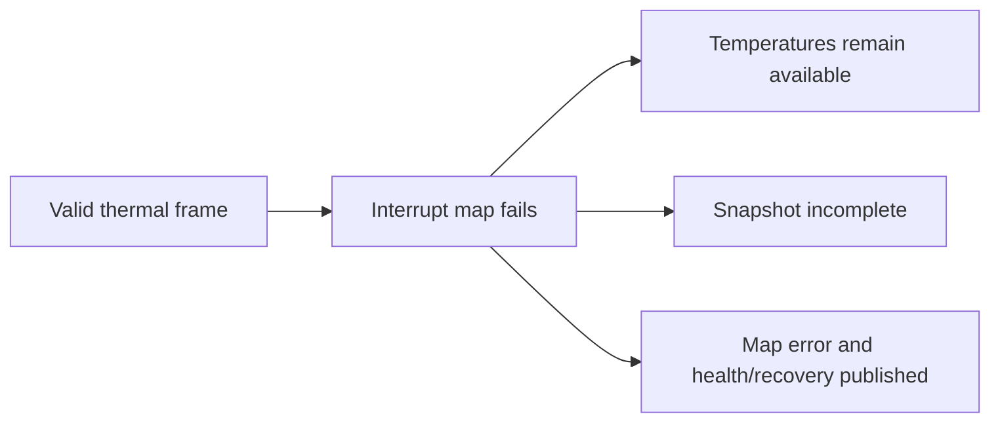
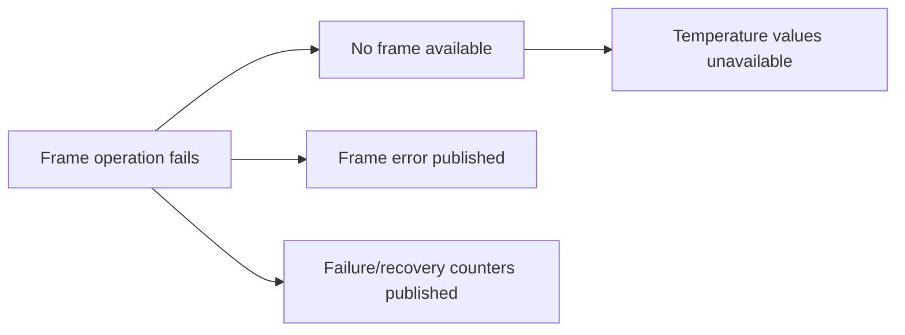
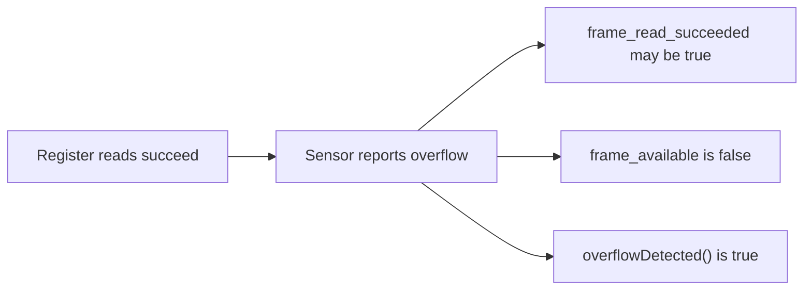
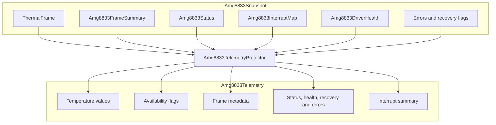

# AMG8833 Telemetry and Milestone 1.8

## 1. Purpose

Milestone 1.8 adds a flat, publication-ready representation of one AMG8833 snapshot.

Before this milestone, the native code could:

- Read and process a thermal frame.
- Report sensor status.
- Track driver health and recovery.
- Read an optional interrupt map.
- Combine those results into an `Amg8833Snapshot`.

The snapshot is intentionally rich. ESPHome should not need to understand all of those native types or duplicate their rules.

`Amg8833TelemetryProjector` therefore converts the snapshot into `Amg8833Telemetry`, which contains scalar values, booleans, counters, and driver error enums.

## 2. Position in the system



Milestone 1.8 does not communicate with hardware and does not publish entities. It defines the contract that makes those future platform steps straightforward.

## 3. Why a projection layer exists

Without a projection layer, an ESPHome component would need to know:

- How frame success differs from frame validity.
- Whether an interrupt-map failure invalidates thermal values.
- Where statistics are stored.
- How recovery flags combine.
- How status and map interrupt signals combine.
- Which health counters are meaningful.
- Whether default numeric values are available.

That would duplicate policy in platform code and make future refactoring risky.

The projector centralizes these decisions.



## 4. Telemetry field groups

### Overall availability

| Field | Meaning |
|---|---|
| `frame_read_succeeded` | The driver completed frame acquisition without an operation error. |
| `frame_available` | A valid, usable thermal frame exists. |
| `snapshot_complete` | Every requested operation completed. |
| `temperature_values_available` | Temperature summary values may be published. |
| `interrupt_map_requested` | The capture requested an interrupt-map read. |
| `interrupt_map_available` | The requested map was acquired successfully. |

### Temperature measurements

| Field | Meaning |
|---|---|
| `minimum_temperature` | Lowest valid frame pixel temperature. |
| `maximum_temperature` | Highest valid frame pixel temperature. |
| `average_temperature` | Average of valid frame pixels. |
| `thermistor_temperature` | Sensor thermistor temperature. |

These numeric values are meaningful only when `temperature_values_available` is true.

### Frame metadata

| Field | Meaning |
|---|---|
| `frame_number` | Driver-assigned frame sequence number. |
| `timestamp_ms` | Capture timestamp in milliseconds. |
| `valid_pixel_count` | Number of pixels included in summary values. |

### Sensor status

| Field | Meaning |
|---|---|
| `sensor_interrupt_active` | Interrupt flag from the status register. |
| `pixel_temperature_overflow` | Sensor reported pixel overflow. |
| `thermistor_overflow` | Sensor reported thermistor overflow. |

### Interrupt-map summary

| Field | Meaning |
|---|---|
| `any_interrupt_pixel_active` | At least one decoded map pixel is active. |
| `active_interrupt_pixel_count` | Count of active interrupt pixels. |

### Driver health

| Field | Meaning |
|---|---|
| `driver_initialized` | Driver initialization state. |
| `driver_healthy` | Current driver health state. |
| `consecutive_failures` | Current consecutive failure count. |
| `total_failures` | Lifetime operation failure count. |
| `recovery_attempts` | Lifetime automatic recovery attempts. |
| `successful_recoveries` | Successful reinitializations. |
| `failed_recoveries` | Failed reinitializations. |

### This-capture recovery

| Field | Meaning |
|---|---|
| `recovery_attempted` | Any operation in the snapshot triggered recovery. |
| `recovery_succeeded` | Every attempted recovery in the snapshot succeeded. |

### Detailed errors

| Field | Meaning |
|---|---|
| `frame_error` | Error from the frame acquisition operation. |
| `interrupt_map_error` | Error from the optional interrupt-map operation. |

## 5. Derived helpers

### `temperaturesAvailable()`

Returns true when usable thermal summary values are present.

Platform use:

```cpp
if (telemetry.temperaturesAvailable())
{
    // Publish minimum, maximum, average and thermistor values.
}
else
{
    // Mark temperature entities unavailable or retain no stale current state.
}
```

### `fullyOperational()`

Returns true when the snapshot is complete and the driver is healthy.

This is stricter than `frame_available`.

A frame can be usable even when an optional interrupt-map read fails. That scenario should preserve temperatures while exposing degraded diagnostics.

### `overflowDetected()`

Returns true when either pixel or thermistor overflow is reported.

### `interruptDetected()`

Returns true when the status register or decoded interrupt map indicates activity.

## 6. Availability scenarios

### Fully successful capture


### Frame succeeds, optional map fails



This is an important design rule. Optional diagnostics must not destroy a valid primary measurement.

### Bus read fails



### Sensor overflow



This shows why operation success and data availability are separate concepts.

## 7. Mapping overview



## 8. Planned ESPHome entity mapping

The exact names are not finalized, but the telemetry contract supports a mapping such as:

### Measurement sensors

- Whole-frame minimum temperature.
- Whole-frame maximum temperature.
- Whole-frame average temperature.
- AMG8833 thermistor temperature.
- Active interrupt-pixel count.

### Binary sensors

- Thermal frame available.
- Snapshot complete.
- Driver healthy.
- Sensor interrupt active.
- Any interrupt pixel active.
- Pixel overflow.
- Thermistor overflow.
- Recovery attempted.

### Diagnostic sensors

- Consecutive failures.
- Total failures.
- Recovery attempts.
- Successful recoveries.
- Failed recoveries.
- Frame error.
- Interrupt-map error.
- Frame number.

Entity categories, disabled-by-default choices, and diagnostic naming should follow current ESPHome conventions when implementation begins.

## 9. Publication rules

The ESPHome layer should follow these rules:

1. Publish temperature measurements only when `temperaturesAvailable()` is true.
2. Do not publish zero defaults as measurements.
3. Preserve a valid thermal frame when only an optional map fails.
4. Expose overflow explicitly.
5. Expose driver health and recovery as diagnostics.
6. Avoid turning every internal field into a default visible entity.
7. Mark noisy or developer-oriented counters as diagnostic and possibly disabled by default.
8. Keep entity naming independent of C++ member names.
9. Log structured errors with enough context to diagnose wiring and bus problems.
10. Do not reimplement snapshot semantics in the ESPHome component.

## 10. Future thermal-frame publication

Milestone 1.8 covers scalar telemetry, not transport of all 64 pixels.

The Home Assistant thermal-image feature will require a separate frame-publication design. Options may include:

- ESPHome text or encoded payloads.
- A compact binary API extension.
- Per-pixel sensors, which are simple but likely too noisy and inefficient.
- A custom Home Assistant integration or dashboard card.
- A local intermediary that receives compact frames.

This should remain separate from `Amg8833Telemetry`. Scalar health and statistics must continue to work even if frame rendering changes.

## 11. Testing requirements

Telemetry tests should confirm:

- Field-for-field projection.
- Correct availability for valid and invalid frames.
- Correct behavior with optional map failure.
- Correct interrupt aggregation.
- Correct overflow aggregation.
- Correct health and recovery counters.
- Correct helper methods.
- No hardware access or state.
- Deterministic output from a given snapshot.

## 12. Completion criteria for Milestone 1.8

Milestone 1.8 is complete when:

- `Amg8833Telemetry` exposes the required scalar contract.
- `Amg8833TelemetryProjector` maps snapshots without hardware access.
- Availability semantics are explicit.
- Derived helper behavior is tested.
- Recovery, status, interrupt, and errors remain observable.
- Native build and tests pass.
- Documentation explains its role before ESPHome integration.
