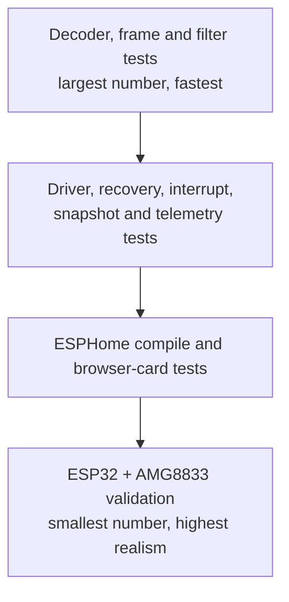
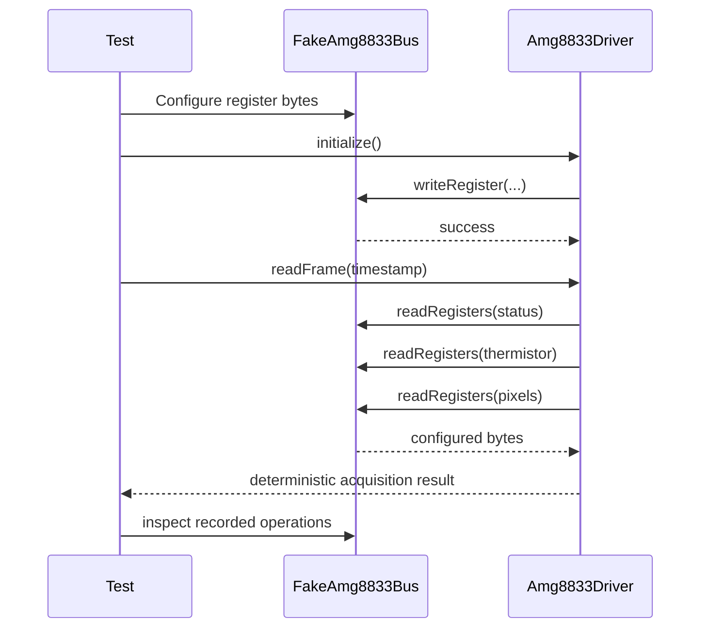

# Testing Guide

## 1. Testing philosophy

LeafSense separates native logic from ESPHome so most behavior can be tested quickly without an ESP32 or physical sensor.

The test strategy is:

1. Test data conversion and algorithms directly.
2. Test driver behavior through a fake bus.
3. Test coordination layers with controlled inputs and failures.
4. Add ESPHome integration tests when the platform layer exists.
5. Validate final behavior on real hardware.

Passing native tests does not replace hardware validation, but it makes hardware failures easier to isolate.

## 2. Test pyramid



## 3. Native test suites

### Core tests

Core tests should cover:

- Signed AMG8833 fixed-point decoding.
- Positive and negative temperatures.
- Thermistor decoding.
- Frame coordinate bounds.
- Frame metadata and validity.
- Mean and median filtering.
- Exponential filter initialization and update.
- Invalid-frame behavior.
- Processing configuration normalization.

### AMG8833 driver tests

Driver tests should cover:

- Initialization register sequence.
- Successful frame acquisition.
- Status decoding.
- Pixel and thermistor reads.
- Bus read and write failures.
- Driver initialization state.
- Frame numbering.
- Processing integration.
- Error values returned to callers.

### Recovery tests

Recovery tests should cover:

- Consecutive failure tracking.
- Lifetime failure tracking.
- Threshold behavior.
- Successful recovery.
- Failed recovery.
- Counter reset behavior.
- Preservation of lifetime health counters.
- Recovery metadata returned with the operation.

### Interrupt tests

Interrupt tests should cover:

- Interrupt configuration writes.
- Status interrupt flag.
- Interrupt-map bit decoding.
- Active-pixel count.
- Map read failure.
- Recovery triggered from an interrupt-map failure.
- Clear/reset behavior if supported.

### Snapshot tests

Snapshot tests should cover:

- Successful frame snapshot.
- Correct minimum, maximum, and average.
- Correct thermistor and valid-pixel count.
- Invalid or overflow frame behavior.
- Optional interrupt-map omission.
- Optional interrupt-map success.
- Frame success with interrupt-map failure.
- Snapshot completeness.
- Combined recovery helpers.
- Health copy behavior.

### Telemetry tests

Milestone 1.8 telemetry tests should cover:

- All scalar values copied from a successful snapshot.
- Availability flags.
- Temperature fields only being marked available when valid.
- Frame and interrupt errors.
- Sensor overflow flags.
- Status and interrupt-map aggregation.
- Driver health counters.
- Recovery flags.
- `temperaturesAvailable()`.
- `fullyOperational()`.
- `overflowDetected()`.
- `interruptDetected()`.
- Frame success with an incomplete optional map.
- Complete but unhealthy driver state.
- Default telemetry behavior.

## 4. Fake bus design

A fake implementation of `Amg8833Bus` should allow tests to:

- Preload register responses.
- Record register reads and writes.
- Fail a chosen operation.
- Fail repeatedly.
- Return short or invalid data where the interface permits.
- Verify order and values of initialization writes.



## 5. Test naming

Test names should describe observable behavior.

Good:

```text
Telemetry marks temperatures unavailable when frame is invalid
Driver attempts recovery after configured consecutive failures
Snapshot remains frame-available when optional interrupt map fails
```

Avoid:

```text
Test telemetry 4
Driver works
Bad frame
```

## 6. Arrange, act, assert

Tests should remain easy to read.

```cpp
TEST_CASE("Telemetry exposes successful frame statistics")
{
    // Arrange
    Amg8833Snapshot snapshot = makeSuccessfulSnapshot();

    // Act
    const auto telemetry =
        Amg8833TelemetryProjector::project(snapshot);

    // Assert
    REQUIRE(telemetry.frame_available);
    REQUIRE(telemetry.temperature_values_available);
}
```

Prefer one primary behavior per test. Several assertions are reasonable when they describe one result object.

## 7. Floating-point comparisons

Thermal values are floating-point numbers. Tests should use the Catch2 approximation mechanism supported by the repository's Catch2 version.

Do not compare calculated temperatures with exact equality unless the representation is guaranteed exact.

Also test boundary and sign behavior, not only typical positive values.

## 8. Failure-path coverage

Every bus operation can fail. Tests should not only prove the happy path.

For a new driver operation, consider:

- Failure before any data is read.
- Failure after partial progress.
- Whether the driver remains initialized.
- Which counter increments.
- Whether recovery is attempted.
- Whether returned data is marked unavailable.
- Whether an optional failure should invalidate the whole result.

## 9. Test execution

Configure:

```bash
cmake -S . -B build -DLEAFSENSE_BUILD_TESTS=ON
```

Build:

```bash
cmake --build build
```

Run all tests:

```bash
ctest --test-dir build --output-on-failure
```

Visual Studio:

```powershell
cmake --build build --config Debug
ctest --test-dir build -C Debug --output-on-failure
```

Run a subset:

```bash
ctest --test-dir build -R telemetry --output-on-failure
```

List registered tests:

```bash
ctest --test-dir build -N
```

## 10. Hardware validation plan

Before the Seed release, test with a real ESP32 and AMG8833.

### Electrical and communication

- Verify wiring and voltage.
- Confirm the expected I²C address.
- Confirm repeated initialization.
- Test cold boot and restart.
- Test a disconnected sensor.
- Test reconnection after a failure if supported by the bus stack.

### Thermal readings

- Compare thermistor reading with ambient reference.
- Compare pixels against a known warm and cool target.
- Confirm negative temperatures where practical or through controlled input.
- Confirm frame orientation.
- Confirm stable frame numbering and update timing.

### Recovery

- Interrupt I²C communication.
- Confirm failure counters.
- Confirm threshold behavior.
- Confirm successful reinitialization.
- Confirm Home Assistant diagnostics remain understandable.
- Confirm stale values are not published as current readings.

### Interrupts

- Configure thresholds.
- Trigger one or more pixels.
- Compare the decoded map with the physical thermal scene.
- Confirm clearing and repeated triggers.

### Long-duration test

Run continuously and record:

- Runtime.
- Total reads.
- Failures.
- Recoveries.
- Memory behavior.
- Wi-Fi reconnects.
- ESPHome API reconnects.
- Stale frames.
- Temperature stability.

## 11. Integration and Milestone 3.0 Alpha tests

The repository includes `homeassistant/tests/leafsense-thermal-card.test.html` for packet CRC, palette output, registration, temperature conversion, device-scoped storage, and pixel-mask/name validation. ESPHome configurations must also be validated and compiled against the supported ESPHome version.

The current browser test is not sufficient to declare the card stable. Add automated or repeatable tests for:

- Pointer and touch click-toggle plus drag paint/erase editing of pixel masks.
- All six channel action sequences and error rollback.
- ROI save/restore across browser refresh and Home Assistant reconnect.
- ESP32 channel restoration after restart and power loss.
- Calibration entity discovery, writes, save/default actions, and state synchronisation.
- Channel-statistics availability and presentation.
- Clean Device Builder import and package installation.
- Desktop, tablet, and mobile layouts.

Until those pass, describe the dashboard as Milestone 3.0 Alpha.

## 12. Future integration tests

When the ESPHome component is added, tests should verify:

- YAML schema validation.
- Default and explicit configuration.
- Entity creation.
- Update scheduling.
- Mapping from `Amg8833Telemetry` to entity states.
- Unavailable-state publication.
- Diagnostic categories.
- Device failure state.
- No publication of invalid default temperatures.
- Region configuration once introduced.

## 13. Definition of tested

A feature is considered adequately tested when:

- Its expected behavior is covered.
- Relevant invalid inputs are covered.
- Relevant hardware/bus failures are covered.
- Public helper semantics are covered.
- All tests pass in a clean build.
- Hardware behavior is validated when required.
- Documentation states any remaining limitation.
